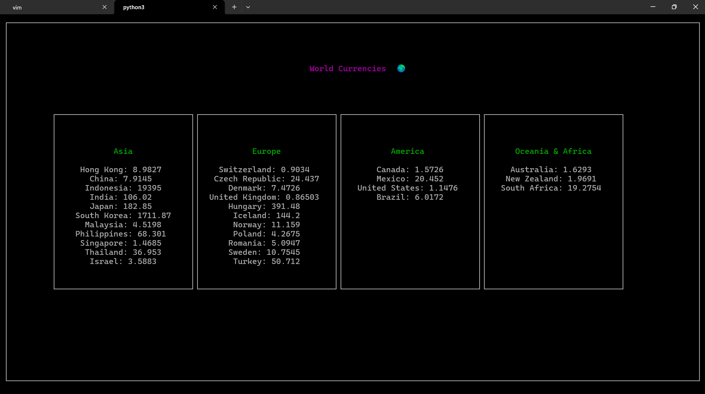

# 🌍 Terminal Currency Tracker

Ever wanted to see how much your money is worth (or not worth) across the globe without leaving the comfort of your terminal? Look no further! 

This is a sleek, **Terminal User Interface (TUI)** that brings world currency rates directly to your command line. No browser, no ads, just pure data and ASCII boxes.

##  See it in Action


##  Features
- **Continent-wise Breakdown:** Organized views for Asia, Europe, America, and Oceania & Africa.
- **TUI Powered:** Built with `curses` for that retro-cool terminal feel.
- **Live-ish Data:** Fetches the latest rates from the [Frankfurter API](https://www.frankfurter.app/).
- **Color Coded:** Because life is better in Magenta and Green.

##  Getting Started

### Prerequisites
You'll need Python installed. If you're on Linux, `curses` is usually built-in. You'll also need the `requests` library.

```bash
pip install requests
```

### Running the App
Just clone the repo and run:
```bash
python currency.py
```

##  Built With
- **Python**  
- **Curses** 
- **Frankfurter API** 

## 🤝 Contributing
Found a bug? Want to add more continents? Feel free to open an issue or submit a pull request!

---
